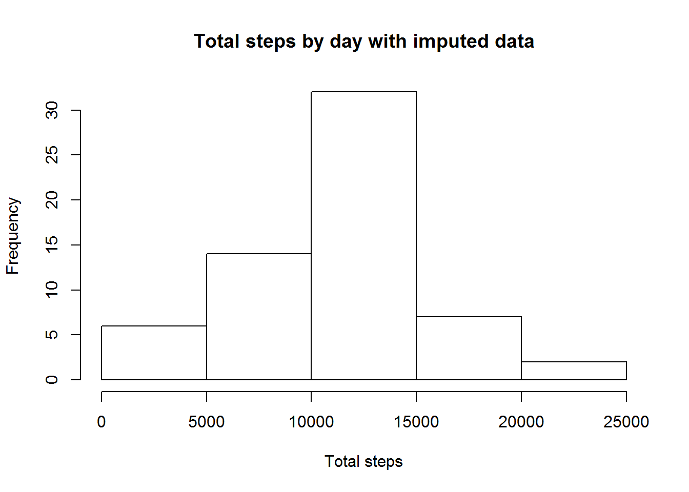
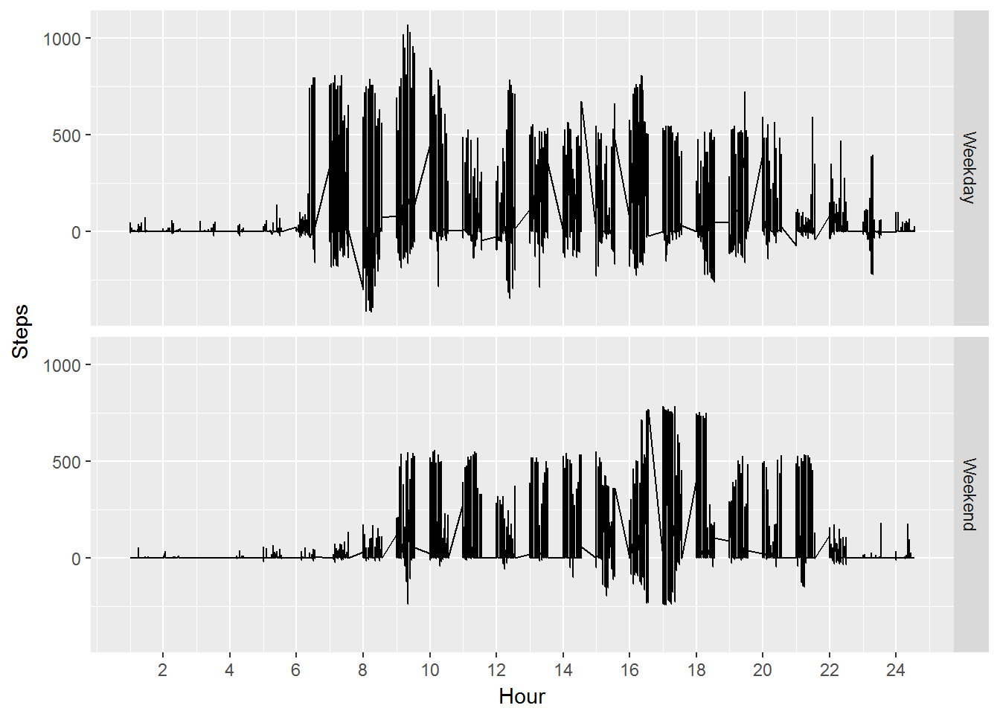

## Introduction  
This code loads data collected from quantified self movement devices. The data will be loaded and utilized in the eight steps enumerated in this document.  The data set used in the project is the [Activity monitoring data](https://d396qusza40orc.cloudfront.net/repdata%2Fdata%2Factivity.zip). 


## 1. Code for Loading and Processing Data
Read.csv is used to the read the data.

```r
step_data <- read.csv("activity.csv",colClasses = c("integer","character","integer"),na.strings = "NA")  
```
The structure of the **step_data** is: 

```r
str(step_data)
```

```
## 'data.frame':	17568 obs. of  3 variables:
##  $ steps   : int  NA NA NA NA NA NA NA NA NA NA ...
##  $ date    : chr  "2012-10-01" "2012-10-01" "2012-10-01" "2012-10-01" ...
##  $ interval: int  0 5 10 15 20 25 30 35 40 45 ...
```
* *steps* variable is the count of steps during the interval
* *date* a charecter representing the date in Year-month-day format
* *interval* an integer representing the hours and minutes during which the steps were counted.  

### Processing the data
No processing occurs on **step_data**. All processing occurs on a new variable **step_proc**.  Initially the only processing on this variable is to convert **step_proc**.*date* to POSix.  The **library lubridate** is used through out this project.

```r
library(lubridate)
```

```
## 
## Attaching package: 'lubridate'
```

```
## The following object is masked from 'package:base':
## 
##     date
```

```r
step_proc <- step_data #start creating a processed version of the dates
step_proc$date <- ymd(step_proc$date)  # change dates to POSix
str(step_proc)
```

```
## 'data.frame':	17568 obs. of  3 variables:
##  $ steps   : int  NA NA NA NA NA NA NA NA NA NA ...
##  $ date    : Date, format: "2012-10-01" "2012-10-01" ...
##  $ interval: int  0 5 10 15 20 25 30 35 40 45 ...
```

## 2. Histogram of the total number of steps taken each day
The histogram of total steps by day shows on most days the total step were between 10000 and 15000 steps. 

```r
hist(aggregate(steps~date,step_data,sum)[,2],
     xlab="Total steps",
     main="Total steps by day")
```


## 3.  Mean and median number of steps taken each day
The mean of steps (observations) for each day is aggregated and stored in **avg_steps**.
The mean and median are calculated below.

```r
avg_steps <- merge(aggregate(steps~date,step_proc,mean),
                 aggregate(steps~date,step_proc,median),
                 by = "date")
names(avg_steps) <- c("Date","Means","Medians")
mean(avg_steps$Means)
```

```
## [1] 37.3826
```

```r
mean(avg_steps$Medians)
```

```
## [1] 0
```

```r
library(ggplot2)
```

Further investigation into the values of the *Median* reveals the proportion of 0 values in **step_proc**.*median* is.

```r
mean(step_proc$steps==0,na.rm=TRUE)
```

```
## [1] 0.7215671
```

## 4.  Time series plot of the average number of steps taken
The time series plot of the average number of steps taken is produced by aggregate the *steps~interval* variable of **step_proc** with the mean function.

```r
avg_steps2 <- aggregate(steps~interval ,step_proc,mean)
ggplot(avg_steps2,aes(interval),main="Mean Step Time Series")+
     geom_line(aes(y = steps)) + 
     ylab("Steps")+
     xlab("Hour")+
     scale_x_continuous(labels=seq(1:24),breaks=seq(100,2400,100))
```


## 5.  The 5-minute interval that, on average, contains the maximum number of steps
The maximum number of steps on average is

```r
max(avg_steps2$steps)
```

```
## [1] 206.1698
```
The maximum occurs at 

```r
avg_steps2$interval[which(avg_steps2$steps==max(avg_steps2$steps))]
```

```
## [1] 835
```

## 6.   Code to describe and show a strategy for imputing missing data

To determine a stratedy for imputing missing data, a basic understanding of the missing data is necessary.  The missing values occur on eight days.  The data are missing for the entire day.

```r
missing <- step_data[which(is.na(step_data$steps)),]
unique(missing$date)
```

```
## [1] "2012-10-01" "2012-10-08" "2012-11-01" "2012-11-04" "2012-11-09"
## [6] "2012-11-10" "2012-11-14" "2012-11-30"
```

```r
length(missing$date)
```

```
## [1] 2304
```
2304 missing values on 8 dates with 288 observation per day means that the missing values are for whole days.  Some of these days weekdays and some are weekends.  I am pressuming that each day and interval are likely to have differences in activity levels as the previous plot have supported this.

### Strategy for imputing missing values.
The strategy for imputing missing values was to sort **step_proc** by the day of the week (*dow*) then *interval*.  The *date* and *steps* sorting are used only because these are required by the order function.  Now the data are ordered appropriately to impute the missing values on the vector from step_proc$steps by using neighboring values.  

The na.spline function from the zoo library is then used to impute the missing values.  This methodology assumes that the day of the week and interval are the most important factors in predicting the number of steps. 


```r
wday(unique(missing$date)) #missing value include different days of the week
```

```
## [1] 2 2 5 1 6 7 4 6
```

```r
step_proc$dow <- wday(step_proc$date)
step_proc<-step_proc[with(step_proc,order(dow,interval,date,steps)),]
na.loc<-is.na(step_proc$steps)
library(zoo)
```

```
## 
## Attaching package: 'zoo'
```

```
## The following objects are masked from 'package:base':
## 
##     as.Date, as.Date.numeric
```

```r
step_proc$steps[na.loc] <- na.spline(step_proc$steps)[na.loc]
detach('package:zoo')
```

## 7. Histogram of the total number of steps taken each day after missing values are imputed

The histogram plots the aggregated steps summed by date.  The plot shows little difference from the plot in 3.

```r
hist(aggregate(steps~date,step_proc,sum)[,2],
     xlab="Total steps",
     breaks=5,
     main="Total steps by day with imputed data")
```



## 8. Panel plot comparing the average number of steps taken per 5-minute interval across weekdays and weekends

The panel plot below shows that the average number of steps taken per 5-minute interval is greater in the morning on weekday than on weekends.  Activity starts earlier on the weekdays than on the weekends.


```r
weekend <- factor(with(step_proc,ifelse(dow==1 | dow==7,"Weekend","Weekday")))
step_proc <- cbind(step_proc,weekend)
ggplot(step_proc,aes(interval),main="Mean Step Time Series")+
     geom_line(aes(y = steps)) + 
     ylab("Steps")+
     xlab("Hour")+
     facet_grid( weekend ~ .)+
     scale_x_continuous(labels=seq(2,24,2),breaks=seq(100,2400,200))
```



## 9. All of the R code needed to reproduce the results (numbers, plots, etc.) in the report
The numbers, plots and etc are presented above.
